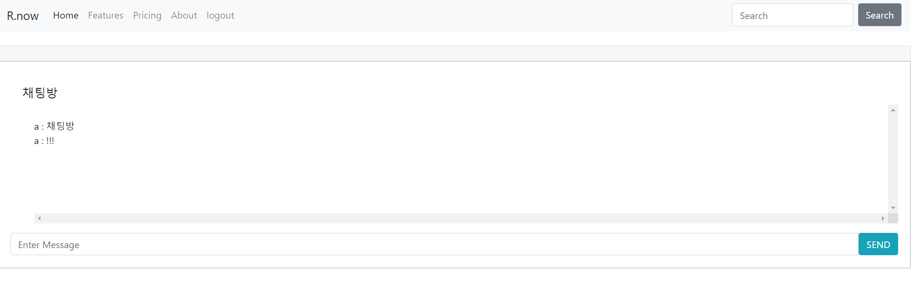

# R.now

* BCryptPasswordEncoder 암호화

* Interceptor

* WebSocket - Chatting

* JNDI

* Mapper Interface

  



```sql
CREATE DATABASE test DEFAULT CHARACTER SET utf8 COLLATE utf8_unicode_ci;

CREATE TABLE `USER` (
  `USER_NAME` varchar(50) PRIMARY KEY,
  `USER_PASSWORD` varchar(500) NOT NULL,
  `USER_EMAIL` varchar(500) NOT NULL,
  `USER_DATE` datetime DEFAULT (now())
);
```


```xml
//server.xml

<Context docBase="R.now" path="/test" reloadable="true" source="org.eclipse.jst.jee.server:R.now">
	<Resource auth="Container" driverClassName="com.mysql.cj.jdbc.Driver" name="jdbc/test" username="root" password="root" type="javax.sql.DataSource" url="jdbc:mysql://127.0.0.1:3306/test?serverTimezone=UTC">
	</Resource>
</Context>
```


```java
/*
ReplyEchoHandler.java
WebSocketSession session에서 HttpSession 객체 가져오기
*/

user = (UserVO) session.getAttributes().get("user");
```


```xml
//root-context.xml

<mybatis-spring:scan base-package="com/project/mapper"/>
```

